# 🚛 Freight Rate Intelligence — Machine Learning Spot Rate Forecasting

[](https://www.python.org/)
[](https://scikit-learn.org/)
[](https://lightgbm.readthedocs.io/)
[](https://pandas.pydata.org/)
[](https://numpy.org/)
[](https://jupyter.org/)
[](LICENSE)

An end-to-end, production-grade Machine Learning pipeline engineered to forecast commercial spot freight rates (`posted_rate`) across 60,000+ nationwide freight loads. Built with strict **Out-Of-Time (OOT) temporal validation**, domain-driven **geospatial and market feature engineering**, and rigorous model benchmarking across linear, tree-bagging, and gradient-boosted ensembles.

---

## 🌟 Executive Summary & Key Results

Freight market spot pricing is notoriously volatile—driven by non-linear capacity signals, lane circuitousness, seasonal holiday demand, and vehicle operating payload limits. This project develops an automated pricing model that delivers high accuracy and operational stability:

| Metric | Baseline (Ridge) | LightGBM | **Champion (Random Forest)** | Improvement vs Baseline |
| :--- | :---: | :---: | :---: | :---: |
| **Mean Absolute Error (MAE)** | $177.83 | $163.18 | **$153.53** | **-$24.30 / load (13.7% reduction)** |
| **Mean Absolute Percentage Error (MAPE)** | 11.42% | 8.71% | **7.10%** | **-4.32% absolute error drop** |
| **Root Mean Squared Error (RMSE)** | $662.91 | $677.51 | **$672.75** | Robust against rate variance |
| **Variance Explained ($R^2$)** | 0.8119 | 0.8035 | **0.8063** | Generalizes strongly Out-Of-Time |

> 🎯 **Key Highlight**: Evaluated on a strictly isolated **October 2025 Out-Of-Time (OOT) Holdout set** (5,088 loads) after training on Jan–Sep 2025 data (42,912 loads), guaranteeing zero temporal data leakage.

---

## 🏗️ End-to-End System Architecture

```mermaid
flowchart TD
    subgraph Ingestion ["1. Data Ingestion & Audit"]
        A1["train_test.csv<br/>48,000 Historical Loads<br/>Jan 01 – Oct 31, 2025"] 
        A2["validation.csv<br/>12,000 Future Loads<br/>Nov 01 – Dec 31, 2025"]
        A3["december-chart-inputs.csv<br/>31 Daily Scenario Rows<br/>Dec 01 – Dec 31, 2025"]
    end

    subgraph Preprocessing ["2. Leakage-Free Preprocessing"]
        B1["Equipment-Specific Median Imputation<br/>Dry Van: 31,367 lbs | Flatbed: 31,469 lbs | Reefer: 31,527 lbs"]
        B2["Time-Series Forward/Backward Filling<br/>for Market Indices & Baseline Signals"]
    end

    subgraph FeatureEngineering ["3. Domain Feature Engineering (31 Features)"]
        C1["Geospatial Metrics<br/>Haversine Distance, Detour Ratio,<br/>Lane RPM Target Encodings"]
        C2["Market & Urgency Signals<br/>Quote Deviation |quote - 2.0|,<br/>Urgency/Distress Flags, Market Interactions"]
        C3["Payload Physics & Work<br/>Ton-Miles = Weight (tons) × Distance"]
        C4["Cyclical Calendar Embeddings<br/>Sine/Cosine Transforms (DOW, Month, Day of Year)"]
    end

    subgraph ValidationStrategy ["4. Temporal Validation"]
        D1["OOT Training Split: Jan 01 – Sep 30, 2025 (89.4%)"]
        D2["OOT Holdout Validation: Oct 01 – Oct 31, 2025 (10.6%)"]
    end

    subgraph ModelBenchmarking ["5. Model Benchmarking & Tuning"]
        E1["Linear Baseline<br/>Ridge Regression (L2)"]
        E2["Gradient Boosting<br/>LightGBM Regressor"]
        E3["Tree Ensemble (Champion)<br/>Random Forest Regressor (300 Trees)"]
    end

    subgraph InferenceDelivery ["6. Validation & Deliverables"]
        F1["validation_predictions.csv<br/>12,000 Predicted Loads"]
        F2["december-chart-inputs.csv<br/>31 Daily Forecasts"]
        F3["score.py Verification<br/>Candidate Chart Generator"]
    end

    Ingestion --> Preprocessing
    Preprocessing --> FeatureEngineering
    FeatureEngineering --> ValidationStrategy
    ValidationStrategy --> ModelBenchmarking
    ModelBenchmarking --> InferenceDelivery
```



---

## 🔍 Domain-Driven Feature Engineering

Standard regression models often fail in freight pricing by assuming direct linear pricing per mile. 31 high-impact features were engineered to capture real-world logistics mechanics:

### 1. Market & Quote Urgency Mechanics
* **Quote Deviation (`quote_deviation`)**: EDA revealed a distinct V-shaped rate sensitivity curve centered around a standard baseline quote signal of `2.0`. Deviations are modeled explicitly as $|quote\_signal - 2.0|$.
* **Urgency & Distress Classifiers**: Loads with `quote_signal > 2.5` trigger premium spot surge pricing (`quote_is_urgent`), while `quote_signal < 1.5` identify discounted/backhaul capacity (`quote_is_distressed`).
* **Market-Quote Interaction**: Synergistic product of macro index pressure and micro quote signal.

### 2. Geospatial Route & Detour Dynamics
* **Haversine Distance**: Exact spherical great-circle distance between pickup and delivery coordinate pairs.
* **Detour Ratio**: $\text{detour\_ratio} = \frac{\text{road\_distance}}{\text{haversine\_distance}}$, penalizing circuitous routes through mountain passes or non-direct highway corridors.
* **Haul Distance Segmentation**: Binary flags for Short Haul ($\le 250$ miles) and Long Haul ($\ge 1,200$ miles) capturing fixed loading overhead vs. variable highway miles.

### 3. Payload Physics & Work Metrics
* **Ton-Miles**: $\text{ton\_miles} = \text{weight\_tons} \times \text{distance}$, quantifying the net mechanical work demand on carrier equipment.
* **Equipment Encodings**: Categorical one-hot features (`Dry Van`, `Flatbed`, `Reefer`) accounting for specialized refrigeration and flatbed tarping premiums.

### 4. Cyclical Calendar Dynamics
* Smooth trigonometric encodings of weekly, monthly, and annual freight cycles:
  $$\text{dow\_sin} = \sin\left(\frac{2\pi \cdot \text{day\_of\_week}}{7}\right), \quad \text{dow\_cos} = \cos\left(\frac{2\pi \cdot \text{day\_of\_week}}{7}\right)$$
  $$\text{month\_sin} = \sin\left(\frac{2\pi \cdot (\text{month}-1)}{12}\right), \quad \text{doy\_sin} = \sin\left(\frac{2\pi \cdot (\text{day\_of\_year}-1)}{365.25}\right)$$

---

## 📊 Model Evaluation & Benchmarks

All models were evaluated on the **October 2025 Out-Of-Time (OOT) Holdout set** to mirror real-world freight deployment:

```
========================================================================================
MODEL BENCHMARK RESULTS (Out-Of-Time October 2025 Holdout — 5,088 Loads)
========================================================================================
Model Family              MAE ($)      RMSE ($)     MAPE (%)     R² Score    Status
----------------------------------------------------------------------------------------
Ridge (Linear Baseline)   $177.83      $662.91      11.42%       0.8119      Baseline
LightGBM Regressor        $163.18      $677.51       8.71%       0.8035      Challenger
Random Forest Regressor   $153.53      $672.75       7.10%       0.8063      🏆 Champion
========================================================================================
```

### 💡 Why Random Forest Outperformed LightGBM:
1. **Robustness to High-Variance Outliers**: Long-haul spot rates occasionally feature extreme multi-thousand dollar surges. Bagging decision trees reduced prediction variance and prevented leaf overfitting on noisy spot spikes.
2. **Smooth Regional Interpolation**: Sub-sampling feature ratios (`max_features=0.6`, `min_samples_leaf=4`) provided superior generalization across unseen lane corridors.

---

## 📈 December 2025 Fixed Lane Scenario & Scorer Verification

To evaluate model consistency across calendar shifts, the champion model was tasked with predicting daily spot rates for a fixed lane throughout **December 1–31, 2025**:
* **Lane**: Lexington, KY $\rightarrow$ Fort Wayne, IN (360 miles)
* **Equipment**: Dry Van | **Weight**: 32,000 lbs

### Candidate December Forecast Chart

The candidate chart below was generated and verified through the official `score.py` validation suite:


### Behavioral Observations:
* **Mid-Month Pricing Stability**: Predicted rate maintains high stability at **~$809.50 – $811.50**, reflecting predictable standard lane economics.
* **End-of-Year Seasonal Adjustment**: The model accurately captures the late-December holiday volume contraction (Dec 29–31 drops to ~$791–$793), reflecting reduced factory shipping output and seasonal demand softening.

---

## 📂 Project Structure

```bash
Freight-Rate-Prediction/
├── data/
│   ├── train-test.csv                       # 48,000 raw training/historical loads (Jan–Oct 2025)
│   ├── validation.csv                       # 12,000 raw test loads (Nov–Dec 2025)
│   ├── validation_predictions.csv           # Completed final submission predictions
│   ├── december-chart-inputs.csv            # Completed 31-day December scenario predictions
│   ├── validation-predictions-template.csv  # Official prediction template
│   └── processed/
│       ├── engineered_train_full.csv        # Engineered feature matrix (Train)
│       ├── engineered_validation_test.csv   # Engineered feature matrix (Validation)
│       └── engineered_december_scenario.csv # Engineered feature matrix (December)
├── notebooks/
│   ├── 01_exploratory_data_analysis.ipynb   # Target distributions, correlation & lane analysis
│   ├── 02_feature_engineering.ipynb         # Imputation pipelines, cyclical & domain transforms
│   └── 03_model_benchmarking.ipynb          # Model training, OOT evaluation & export pipeline
├── reports/
│   └── ml_assessment_report.md              # Detailed technical ML assessment report
├── scorer_results/
│   └── candidate_december.png               # Official verification chart from score.py
├── score.py                                 # Official submission & constraint validation script
├── requirements.txt                         # Project dependencies
└── README.md                                # Project documentation & showcase
```

---

## 🚀 Quickstart & Execution Guide

### 1. Clone & Setup Environment

```bash
# Clone the repository
git clone https://github.com/shoaib1760/Freight-Rate-Prediction.git
cd Freight-Rate-Prediction

# Create and activate virtual environment
python -m venv .venv
source .venv/bin/activate  # On Windows: .venv\Scripts\activate

# Install dependencies (or use uv)
pip install -r requirements.txt
# With uv:
# uv pip install -r requirements.txt scikit-learn lightgbm jupyter
```

### 2. Run the Notebooks
Execute the modular Jupyter notebooks sequentially in `notebooks/`:
```bash
jupyter notebook notebooks/
```
1. `01_exploratory_data_analysis.ipynb` — Data profiling, distribution skewness, correlation heatmaps.
2. `02_feature_engineering.ipynb` — Imputation, domain transforms, OOT train/test splitting.
3. `03_model_benchmarking.ipynb` — Model training, cross-validation, champion model inference.

### 3. Verify Submission Constraints & Generate Chart
Execute `score.py` to validate exact ID alignment, positive rate constraints, and produce the December chart:
```bash
python score.py --predictions data/validation_predictions.csv --december-predictions data/december-chart-inputs.csv
```
**Output:**
```text
Validated 12,000 final predictions.
Validated 31 fixed December predictions.
Created chart: scorer_results/candidate_december.png
Final validation metrics are calculated by Spotter after submission.
```

---

## 🛠️ Key Technologies & Skills Demonstrated

* **Machine Learning**: Out-Of-Time (OOT) Validation, Bagging Ensembles (Random Forest), Gradient Boosted Trees (LightGBM), Regularized Regression (Ridge).
* **Feature Engineering**: Cyclical Trigonometric Encodings, Geospatial Detour Ratios, Non-linear Quote Price Sensitivity Modeling, Ton-Miles Mechanical Work Metrics.
* **Data Science & Analytics**: Pandas, NumPy, Scipy, Matplotlib, Seaborn, Missing Data Imputation, Outlier Handling.
* **Production Standards**: Leakage-free split pipelines, reproducible seeds, automated constraint verification (`score.py`).

---

## 👤 Author & Contact

**Shoaib Abid**  
Machine Learning Engineer & Data Scientist  
* **GitHub**: [@shoaib1760](https://github.com/shoaib1760)  
* **LinkedIn**: [Shoaib Abid](https://linkedin.com/in/shoaib-abid)  
* **Project Repository**: [Freight-Rate-Prediction](https://github.com/shoaib1760/Freight-Rate-Prediction)

---
*If you find this project insightful for freight logistics pricing or machine learning pipeline design, feel free to give it a ⭐ on GitHub!*
