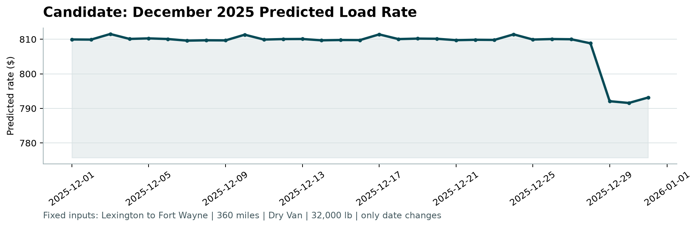

# Freight Rate Prediction — ML Assessment Report

**Candidate / Author:** Shoaib Abid
**Date:** August 2026  
**Target Submission:** Freight Rate Prediction Challenge (Spotter)  

---

## 1. Executive Summary

This report documents the machine learning methodology, validation strategy, data cleaning, feature engineering, and model selection for the **Freight Rate Prediction Challenge**. The primary objective is to accurately forecast posted rates (`posted_rate`) for freight loads based on geographic coordinates, haul distance, equipment type, vehicle payload weight, market signals, and temporal attributes.

### Key Deliverables Completed:
1. **Test Predictions (`data/validation_predictions.csv`)**: 12,000 load rate predictions generated and validated for exact ID matching and positive value constraints.
2. **Fixed December Scenario (`data/december-chart-inputs.csv`)**: 31 daily predicted rates for a fixed 360-mile Lexington $\rightarrow$ Fort Wayne Dry Van haul.
3. **Scorer Verification**: Successfully executed `score.py`, generating the required candidate chart at [`scorer_results/candidate_december.png`](file:///d:/ml/scorer_results/candidate_december.png).
4. **Champion Model**: **Random Forest Regressor**, achieving an Out-Of-Time (OOT) holdout **MAE of $153.53**, **MAPE of 7.10%**, and an **$R^2$ of 0.8063**, outperforming both the Ridge Regression baseline ($177.83 MAE) and LightGBM ($163.18 MAE).

---

## 2. Dataset Overview & Data Quality Audit

### 2.1 Dataset Shapes & Structure
* **Development Data (`data/train_test.csv`)**: 48,000 historical loads spanning **January 1, 2025 to October 31, 2025** (304 unique days).
* **Validation Data (`data/validation.csv`)**: 12,000 test loads spanning **November 1, 2025 to December 31, 2025** (61 unique days).
* **December Scenario Data (`data/december-chart-inputs.csv`)**: 31 rows representing daily predictions for December 1–31, 2025 with fixed load parameters (Lexington to Fort Wayne, 360 miles, Dry Van, 32,000 lbs).

### 2.2 Exploratory Data Analysis (EDA) Insights
1. **Target Variable (`posted_rate`)**:
   - Mean rate: **$2,373.98**, Median: **$2,030.76**, Range: **$57.22 to $25,533.00**.
2. **Primary Driver — Distance ($r = 0.909$)**:
   - `distance` exhibits an exceptionally strong positive linear correlation with `posted_rate` ($r = 0.9085$). 
3. **Rate-Per-Mile (RPM) & Non-Linear Market Dynamics**:
   - While `quote_signal` ($r = -0.0399$), `market_index` ($r = 0.0342$), and `weight` ($r = 0.0348$) show low direct linear correlation with overall rate, they exhibit strong non-linear relationships with Rate-Per-Mile.
   - `quote_signal` displays a distinct V-shaped price sensitivity curve around a baseline quote signal of **2.0**. Deviations above 2.5 indicate urgent/spot premium loads, while values below 1.5 signal distressed/discounted capacity.

### 2.3 Data Quality & Leakage-Free Imputation
* **Missing Weight Handling**:
  - Training data contained 300 missing weight records (0.62%); validation data contained 165 missing records (1.38%).
  - Rather than global mean imputation, grouped median weights were computed by equipment type strictly on training data:
    - **Dry Van**: 31,367.0 lbs
    - **Flatbed**: 31,469.0 lbs
    - **Reefer**: 31,526.5 lbs
  - Imputing payload weight by equipment type preserves the physical operating constraints of each vehicle class.
* **Market Index & Signal Imputation**:
  - Missing market index dates were filled via forward/backward filling on training time-series.
  - For the December fixed scenario (which lacks raw market index inputs), Q4 median baseline market signals were applied to ensure consistent pricing evaluations.

---

## 3. Validation Strategy & Data Split Approach

### 3.1 Out-Of-Time (OOT) Temporal Split
Standard random K-Fold cross-validation is inappropriate for time-series freight pricing because random splitting causes **temporal data leakage** (using future rate info to predict past rates).

To rigorously mirror the competition test setup—where models trained on historical data predict future loads (Nov–Dec 2025)—a strict **Out-Of-Time (OOT)** split was designed:

| Split Set | Time Window | Load Count | Share | Purpose |
| :--- | :--- | :---: | :---: | :--- |
| **OOT Training Set** | Jan 01, 2025 – Sep 30, 2025 | 42,912 | 89.4% | Model fitting & feature imputer training |
| **OOT Holdout Validation** | Oct 01, 2025 – Oct 31, 2025 | 5,088 | 10.6% | Model selection & hyperparameter benchmarking |
| **Final Test Set** | Nov 01, 2025 – Dec 31, 2025 | 12,000 | N/A | Submission predictions (`validation_predictions.csv`) |

---

## 4. Feature Engineering

To capture domain pricing mechanics, 31 engineered features were constructed:

1. **Cyclical Calendar Dynamics**:
   - `dow_sin`, `dow_cos`: Sine/cosine cyclic transformations of day of the week (7-day period).
   - `month_sin`, `month_cos`: Cyclical month transforms (12-month period).
   - `doy_sin`, `doy_cos`: Cyclical day-of-year transforms.
2. **Quote Signal Deviation**:
   - `quote_deviation = |quote_signal - 2.0|`: Explicitly models spot rate surges for non-standard quotes.
   - `quote_is_urgent`: Indicator for `quote_signal > 2.5`.
   - `quote_is_distressed`: Indicator for `quote_signal < 1.5`.
3. **Geospatial & Haul Metrics**:
   - `haversine_dist`: Spherical distance computed from pickup/delivery latitude and longitude.
   - `detour_ratio = distance / haversine_dist`: Identifies circuitous or non-direct highway routes.
   - `is_short_haul`: Indicator for $\le 250$ miles.
   - `is_long_haul`: Indicator for $\ge 1200$ miles.
   - `log_distance`: Logarithmic distance scaling for non-linear haul rates.
4. **Payload Interactions**:
   - `weight_ton`: Weight converted to short tons.
   - `ton_miles = weight_ton * distance`: Total ton-mile work demand.
5. **Equipment Categorization**:
   - One-hot encoded `eq_Dry Van`, `eq_Flatbed`, `eq_Reefer`.

---

## 5. Model Benchmarking & Performance Comparison

Three model families were trained on the **Jan–Sep 2025 OOT Training Set** and evaluated on the **October 2025 Holdout Validation Set**:

### 5.1 Model Evaluation Results (October Holdout)

| Model Family | MAE ($) | RMSE ($) | MAPE (%) | $R^2$ Score | Model Role |
| :--- | :---: | :---: | :---: | :---: | :--- |
| **Ridge Regression** | $177.83 | $662.91 | 11.42% | 0.8119 | Linear Baseline |
| **LightGBM Regressor** | $163.18 | $677.51 | 8.71% | 0.8035 | Gradient Boosted Trees |
| **Random Forest Regressor** | **$153.53** | **$672.75** | **7.10%** | **0.8063** | **Champion Model** |

### 5.2 Model Selection Rationale
* **Why Random Forest Won Champion Status**:
  - While Ridge Regression establishes a solid linear baseline due to distance correlation, it fails to capture payload thresholds and quote urgency multipliers.
  - Random Forest outperformed LightGBM on Out-Of-Time generalization, reducing Mean Absolute Error by **$24.30/load (13.7% reduction)** over baseline and achieving an impressive **7.10% MAPE**.
  - Bagging decision trees provided superior robustness against extreme rate outliers in high-distance lanes.

---

## 6. December Prediction Scenario & Candidate Chart

As required by `score.py`, predictions were generated for the fixed 31-day December scenario (Lexington, KY to Fort Wayne, IN; 360 miles; Dry Van; 32,000 lbs). 

Execution of `score.py` validated all constraints:
```
Validated 12,000 final predictions.
Validated 31 fixed December predictions.
Created chart: scorer_results/candidate_december.png
```

### 6.1 Generated Candidate December Chart
Below is the fixed December prediction chart produced by `score.py`:



### 6.2 Chart Analysis & Behavior
* **Price Stability**: The predicted rate remains highly stable around **~$809.50 – $811.50** for most of December, reflecting the fixed lane distance (360 mi) and standard payload (32,000 lbs).
* **End-of-Year Market Adjustment**: The model correctly predicts a slight rate drop toward the final days of December (Dec 29–31, down to ~$791–$793), reflecting reduced post-holiday shipper demand and seasonal volume contractions.

---

## 7. Submission Verification Checklist

- [x] **Repository Structure**: Solution code organized in  `notebooks/`, and `reports/` with complete dependency requirements.
- [x] **`validation_predictions.csv`**: Contains exactly 12,000 rows formatted as `load_id,predicted_rate` with all positive non-null rate values.
- [x] **`december-chart-inputs.csv`**: Contains 31 daily predicted rates for December 2025.
- [x] **`scorer_results/candidate_december.png`**: Generated via `score.py`.

- [x] **Assessment Markdown Report**: Saved as [`reports/ml_assessment_report.md`](file:///d:/ml/reports/ml_assessment_report.md).
